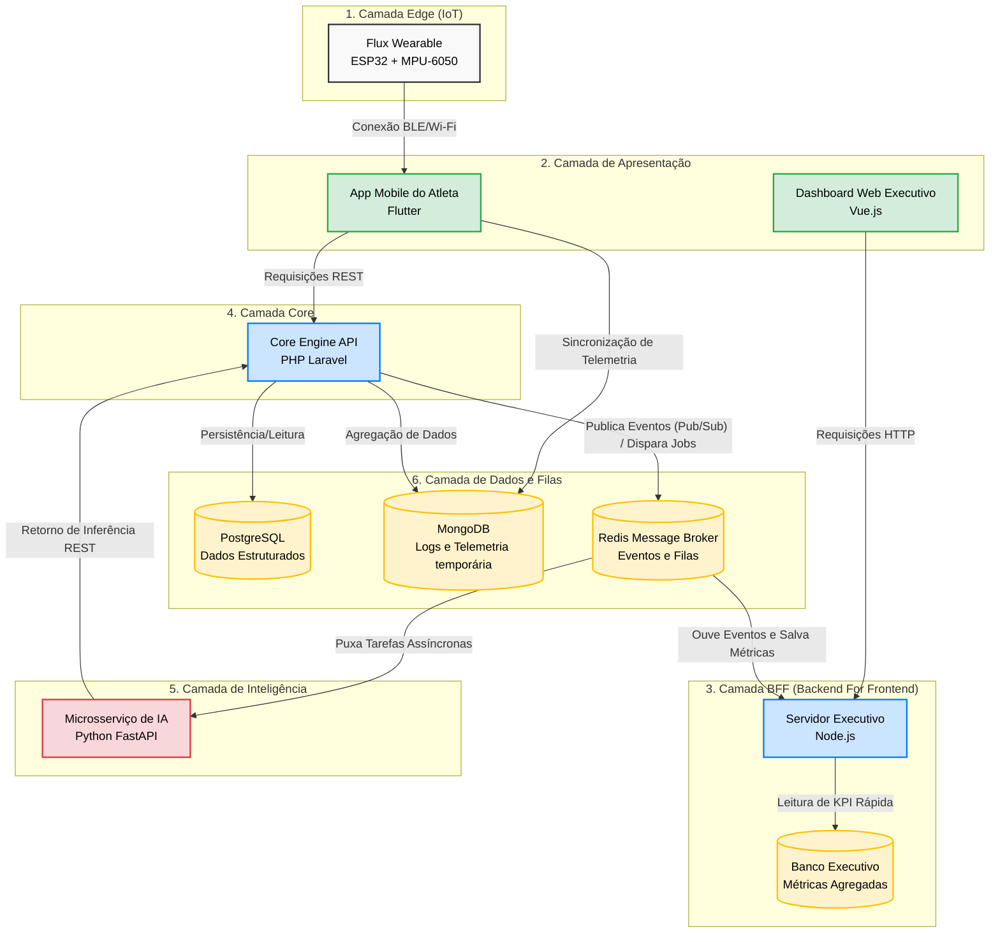

# Arquitetura de Infraestrutura - Flux

O diagrama abaixo ilustra a macro-arquitetura do ecossistema Flux, demonstrando a separação de responsabilidades através do padrão de microsserviços e a comunicação orientada a eventos.

## Descrição do Fluxo Atualizado (Orientado a Eventos)
1. O **Flux Wearable** transmite dados de movimento para o **App Mobile**.
2. O App Mobile envia as avalanches de telemetria direto para o **MongoDB** e avisa o **Core PHP** do início/fim do treino.
3. O **Core PHP** usa o **Redis** para colocar a análise dos movimentos em uma fila assíncrona.
4. O **Microsserviço de IA (Python)** puxa a tarefa da fila, classifica os golpes e devolve para o PHP.
5. O PHP consolida o treino no banco relacional final (**PostgreSQL**).
6. Após salvar no PostgreSQL, o PHP "grita" um evento de novo treino no **Redis (Pub/Sub)**.
7. O **Servidor Executivo (Node.js)** escuta o Redis passivamente. Ao receber o aviso, ele salva uma métrica resumida e anônima (ex: +1 treino realizado) no seu próprio **Banco Executivo**.
8. Os diretores acessam o **Dashboard (Vue.js)** que consome apenas o Banco Executivo do Node.js, garantindo velocidade instantânea (OLAP) e proteção de que, se o PHP cair, o painel de diretoria segue intacto.
